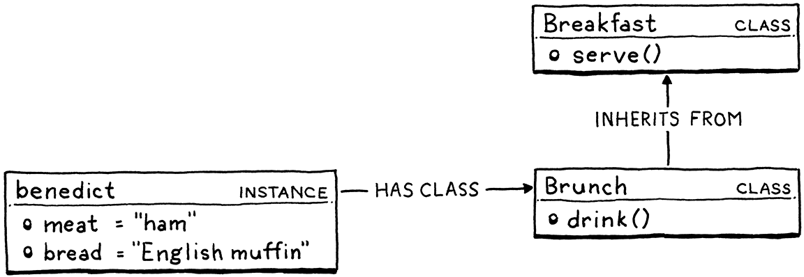

- [3 __Lox语言__](#3-lox语言)
  - [Hello，Lox](#hellolox)
  - [一个高级语言](#一个高级语言)
    - [动态类型](#动态类型)
    - [自动内存管理](#自动内存管理)
  - [数据类型](#数据类型)
  - [表达式](#表达式)
    - [算数表达式](#算数表达式)
    - [比较和相等](#比较和相等)
    - [逻辑操作符](#逻辑操作符)
    - [优先级和分组](#优先级和分组)
  - [语句](#语句)
  - [变量](#变量)
  - [控制流](#控制流)
  - [函数](#函数)
    - [闭包(closures)](#闭包closures)
  - [类](#类)
    - [选择面向对象的理由](#选择面向对象的理由)
    - [类还是原型](#类还是原型)
    - [Lox中的类](#lox中的类)
    - [实例化和初始化](#实例化和初始化)
    - [继承](#继承)
  - [标准库](#标准库)
    - [设计笔记：表达式和语句(expressions and statements)](#设计笔记表达式和语句expressions-and-statements)
## 3 __Lox语言__
本章是对Lox的一个简单的描述，没有语言规范，仅仅是为了让我们了解最终将要实现什么样的一个语言。
### Hello，Lox
Lox的语法是类C的。这样的好处是 _熟悉_。
>C的语法绝不是优雅的。大部分C的恶劣语法问题都跟类型有关。Dennis Ritchie认为"[声明反应了使用方式](http://softwareengineering.stackexchange.com/questions/117024/why-was-the-c-syntax-for-arrays-pointers-and-functions-designed-this-way)"，意思是变量声明是反映了你为了获取基本类型的值所必须要对变量做的操作。Lox不是静态类型的。

### 一个高级语言
为了在本书介绍Lox的两个实现，所以Lox自身的语法不得不相当紧凑。所以Lox是一个高级“脚本”语言，就像JavaScript，Scheme和Lua。Lox看起来最像JavaScript。后面我们会看到，Lox的作用域非常接近Scheme。而在第三部分C实现的Lox，重度依靠Lua的实现。

#### 动态类型
Lox是动态类型的，如果在某个类型的值执行了错误的操作，会在运行时检测和报告错误。
#### 自动内存管理
管理内存有两种主要的技术：引用计数(reference counting)和跟踪垃圾收集(tracing garbage collection，通常也叫做垃圾收集(garbage collection)或者GC)。前者实现简单，但是由于有循环引用的存在，很难根治。所以即使有语言是从引用计数开始的，也最终转向了跟踪式GC，至少是足够清理循环引用的程度。本书会实现一个GC。

### 数据类型
Lox存在几个内建类型。这里列出几个：
* __Booleans。__ Lox专有的`Boolean`类型，而不像那些古老的语言重用了已经存在的类型表示真和假。
* __Numbers。__ Lox的数字是双精度浮点数。为了简化，只支持整数和十进制字面量。
* __String。__ 被封闭在双引号的字符序列组成了字符串字面量。
* __Nil。__ `Nil`用来表示空。这么叫的原因是区分Lox的`nil`和Java或者C的`null`。
### 表达式
#### 算数表达式
Lox的基本算术表达式来自于C。
```C
add+me;
subtract-me;
multiply*me;
divide/me;
```
操作符两侧的子表达式叫做 __作数(operands)__。上面的例子的操作符有两个操作数，因此也叫做 __二元(binary)__ 操作符。又因为操作符位于两个操作数中间，又叫做 __中缀(infix)__ 操作符(区别于 __中缀(prefix)__ 和 __后缀(postfix)__ 操作符，前者操作符位于所有操作数之前，后者操作符位于所有操作符之后)。`-`号，既有中缀的形式，又有前缀的形式，后者用来表示对一个数字取负数。除了`+`号，所有操作符只能作用于数字，`+`号还可以用来连接两个字符串。

#### 比较和相等
使用`><`比较两个数字(只能是数字)是否大小。可以使用`==`测试任意两个类型的值是否相当。类型不同的值永远不相等。

#### 逻辑操作符
非操作符是一个前缀的`!`，错过操作数是`true`，就返回`false`。剩下的操作符其实是控制流结构。`and`操作符判断两个值是否都是`true`。如果左操作数是`false`就返回左操作数，否则返回右操作数。`or`操作符判断两个值是否至少有一个是`true`。如果左操作数是`true`就返回他，否则返回右操作数。由于这种 __短路操作(short-circuit)__ ，因此这两个操作符被看作是控制流，因为如果估值(evaluate)结果是返回左操作数，那么右操作数都不会杯evaluate。

#### 优先级和分组
Lox所有操作符的优先级和结合性同C语言一样。

### 语句
表达式的主要工作是产生一个值，而语句的工作产生一个效果(effect)。因为根据定义，语句不会对值(value)估值，因此语句如果要有用，必须要以某种方式能够改变世界——通常是修改某个状态，读取输入，火车产生输出。语句后面跟一个分号(;)，就将表达式提升为语句，叫做 __表达式语句(expression-statement)__。通过使用 __块(block)__ 可以将多个语句打包成一个，块还会影响作用域。

### 变量
使用`var`语句声明变量。如果没有初始化，默认是`nil`。

### 控制流
Lox的控制流语句都来自于C语言`if`，`for`和`while`。

### 函数
函数调用表达式看起来和C语言一样。
```C
makeBreakfast(bacon,eggs,toast);
```
也可以不用传入实参就调用某个函数：
```C
makeBreakfast();
```
如果没有圆括号，那么就不是调用函数，而是引用它。
可以使用`fun`关键字定义一个函数。
```
fun printSum(a,b){
  print a+b;
}
```
* __实参(argument)__ 当调用一个函数的时候，实际传给函数的值叫做实参，因此，函数 _调用(call)_ 有 _实参_ 列表 也叫做 __actual parameter__。
* __形参(parameter)__ 在函数体内，持有实参值得变量叫做形参。因此函数 _声明(declaration)_ 有 _形参_ 列表，也叫做 __formal parameters__ 或者是 __formal__。

函数体始终是一个block，可以通过`return`语句返回一个值。如果执行体在到达block的结尾都没有遇到`return`，它就隐式返回`nil`。
#### 闭包(closures)
在Lox中，函数是 _第一类(first class)_，这意味着你可以引用它，存在变量中，作为参数传递，等等。
```
fun addPair(a,b){
  print a+b;
}

fun identify(a){
  return a;
}

print identify(addPair)(1,2);
```
因为函数声明是语句，因此可以在一个函数中定义一个本地函数。
```
fun outerFunction(){
  fun localFunction(){
    print "I'm local!";
  }
  localFunction();
}
```
考虑下面的情况：
```
fun returnFunction(){
  var outside = "outside";
  fun inner(){
    print outside;
  }
  return inner;
}
var fn = returnFunction();
fn();
```
当结合了局部函数，第一类函数和块作用域，这里`inner()`访问了定义在包围了它的函数的函数体的变量，为了让这个逻辑可以工作，`inner()`必须要持有它使用了的所有环绕变量，这样，当外部函数返回后，`inner()`还可以保持它们。我们这样做的函数叫做 __闭包(closure)__。

### 类
#### 选择面向对象的理由
尽管每时每刻都在继承导致了巨大的类体系，但是 __面向对象编程(object-oriented programming)__ 依旧有着相当的生命力。特别的，对于动态类型的语言，对象很方便。我们需要 _某种_ 定义复合数据类型方式将东西绑定在一起。

#### 类还是原型
有两种方式方式实现对象，[类](https://en.wikipedia.org/wiki/Class-based_programming)和[原型](https://en.wikipedia.org/wiki/Prototype-based_programming)。

对于基于类的语言，核心是：实例和类。实例存储每个对象的状态并拥有实例所属类的引用。类包含方法和继承链。从实例上调用一个方法总会多一层间接调用，需要从实例找到所属类，然后查找到方法。在类似C++这样的静态类型语言中，方法查找一般发生在编译期，基于实例的静态类型，叫做 __静态分派(static dispatch)__。__动态分派(dynamic dispatch)__ 在运行时查找实际的实例对象的类。这就是静态类型语言的虚方法(virtual method)和动态类型语言所有的方法的工作方式。



基于原型的语言，只有对象没有类，每个独立的对象都有状态和方法。对象可以直接的继承其他对象(或者说是以原型的方式“委托”给其他对象)。


在某些方面，原型比类更基本，它们很容易实现，而且可以表达出很多类引导你远离的模式。

但是很多时候，使用原型语言的人会用原型重新发明类，人们似乎更倾向于基于类的风格。原型在语言中更简单，但看起来是通过把复杂性推给用户实现的。

#### Lox中的类
定义类的方式如下：
```
class Breakfast{
  cook(){
    print "Eggs a-fryin'!";
  }

  serve(who){
    print "Enjoy your breakfast, "+ who +".";
  }
}
```
类的声明体包含它的方法。当类声明被执行后，Lox创建一个类对象并将它存在以这个类名命名的变量里。跟函数一样，Lox的类也是第一类公民。为了简单Lox的类自身也是实例的工厂函数。以函数的方式调用类，就会返回一个自身的实例。


#### 实例化和初始化
Lox允许自由的给对象增加属性。
```
breakfast.meat = "sausage";
breakfast.bread = "sourdough";
```
如果赋值给一个不存在的属性，就会自动创建它。可以通过`this`访问在当前对象的方法内访问它的属性或者方法。
```
class Breakfast{
  serve(who){
    print "Enjoy your " + this.meat + " and " + this.bread + ", "+ who +".";
  }
}
```
如果有一个方法名字叫做`init()`，他么Lox就认为它是这个类的初始化器，他会在对象被构造的时候动态自动调用。所有传递给类的形参都会转发给`init()`方法。
```
class Breakfast{
  init(meat,bread){
    this.meat = meat;
    this.bread = bread;
  }
}

var baconAndToast = Breakfast("bacon","toast");
baconAndToast.serve("Dear reader");
```
#### 继承
Lox支持单继承。当声明一个类时，使用小于(`<`)符号标识一个类是从哪个类继承的。
```
class Brunch < Breakfast{
  drink(){
    print "How about a Bloody Mary?";
  }
}
```
这里，`Brunch`是 __继承类(derived class)__ 也叫 __子类(subclass)__ ，`Breakfast`是 __基类(base class)__ 或者 __超类(superclass)__。超类中定义的所有方法都可以在子类中使用，包括`init()`方法。
```
var benedict = Brunch("ham", "English muffin");
benedict.serve("Noble Reader");
```
使用`super`关键字可以在子类覆写的方法中调用父类的同名方法。
```
class Brunch < Breakfast{
  init(meat,bread,drink){
    super.init(meat,bread);
    this.drink = drink;
  }
}
```
Lox不是纯OO的语言。如果是纯OO的，那么语言中所有的对象都是一个类的实例。即使是基本类型比如数字和布尔值。

### 标准库
标准库或者核心库是直接在解释器中实现的功能集合，所有用户行为都构建在这之上。我们不会涉及很多标准库。
#### 设计笔记：表达式和语句(expressions and statements)
Lox既有表达式也有语句，某些语言会忽略后一个，它们会把声明以及控制流结构也看做表达式。这些"一切皆表达式"语言多是有函数式血统的语言，包括大多数Lisp，SML，Haskell，Ruby以及CoffeeScript。为了做到这个，对于这个语言中每一个"类似语句的"构造，需要确定它的估值结果是什么。有一些很简单，比如：
* `if`表达式估值的结果就是被选中的分支，类似的，`switch`或者其他多路分支的结果就是选中的场景。
* 变量声明估值结果就是变量的值
* block的估值就是整个表达式序列最后一个表达式的结果
而有些语句就很奇怪。比如，循环的估值结果应该是什么？在coffeeScript中`while`循环的估值结果就是一个数组，其中每一个元素包含的都是循环体的估值结果。这可能很方便，但是如果不需要这个数组，就很浪费空间。(两个问题：一，如果是无线循环怎么办？二，数组中每一个元素是每次循环执行的循环体的估值么，我个人感觉是的)。还需要决定这些类似语句的表达式和其他表达式的组合——需要将他们填入到语法优先级表中。例如，Ruby允许：
```ruby
puts 1 + if true then 2 else 3 end + 4
```
这是你期望的么？是用户期望的么？这会怎么影响你如何设计你的"语句"？注意，Ruby有一个显式的`end`告诉什么时候`if`表达式完成。没有它，`+4`很可能会被解释为`else`的一部分。

将每个语句转换为表达式强迫你需要回答类似难缠的问题，但是你消除某些冗余。C既有为了组合一系列语句的block语法，也有逗号操作符(comma operator)组合一系列表达式。它既有`if`语句和`?:`条件操作符。如果在C中，一切皆表达式，就可以统一这一切了。

没有语句的语言通常会有隐式返回(implicit return)的功能。不需要显式的`return`的语法，函数会自动返回它函数体的估值结果。对于小的函数和方法，这很方便。事实上，很多有语句的语言也增加了类似`=>`的语法可以定义整个函数体是对单个表达式估值的结果的函数。

但是，如果你不仔细，你的函数就会泄露一个返回值，尽管你只希望产生一个副作用。尽管，实际上，那些没有语句的语言并不认为这是一个问题。