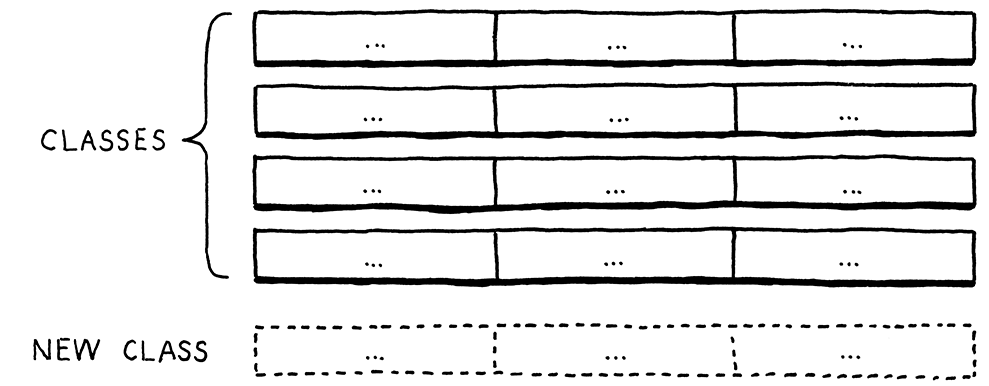

- [代码表示](#代码表示)
  - [上下文无关语法(context-free grammars)](#上下文无关语法context-free-grammars)
  - [语法规则](#语法规则)
  - [强化我们的标记](#强化我们的标记)
  - [Lox表达式的语法](#lox表达式的语法)
  - [实现语法树](#实现语法树)
    - [不面向的对象(disoriented objects)](#不面向的对象disoriented-objects)
    - [对树进行元编程](#对树进行元编程)
  - [操作树](#操作树)
    - [表达式问题](#表达式问题)
    - [访问者模式](#访问者模式)

## 代码表示
我们通常可以使用一个树结构表示一个算数表达式，这个表达式的叶子节点是各个数字，而中间节点是操作符，节点的分支是操作数。通过后序遍历这个树，就可以计算整个表达式。


树对于我们的代码确实是一个可行的表示，可以匹配我们语言操作符可以嵌套的语法结构(grammatical structure)，但是我们需要更加明确这个语法是什么。在[第四章](../chapter4/Scanner.md)中，我们介绍了词法(lexical grammar)，和它一样，语法(syntactic grammar)的背后也有一大堆理论作为支撑。相对于在扫描的过程中涉及到的理论，我们本章将引入更多的理论，因为在解释器中，这非常有用。我们需要移动到 [乔姆斯基体系(chomsky hierarchy)](https://en.wikipedia.org/wiki/Chomsky_hierarchy) 中更上一个层级。

### 上下文无关语法(context-free grammars)
定义词法规则(如何将字符组合成tokens)的形式(formalism)叫做正则语言。这对于`scanner`来说是够的，因为它只是产生`tokens`的平坦序列(flat sequence of tokens)。但是这对于处理可以嵌套任意深度的表达式是不够的。所以我们需要 __上下文无关语法(context-free grammar CFG)__ 处理这种情况。这是[形式语法](https://en.wikipedia.org/wiki/Formal_grammar)的一个重量级工具。形式语法采用一个原子片段集合作为它的"字母表(alphabet)"。然后在语法中定义了一个"字符串"集合(通常是无限的)。每个字符串都是字母表中的"字母"序列。注意，这里打引号的原因是词法和语法是不同的。在词法中字母表是由独立的字符组成，并且这些字符串是有效的词素。而在我们现在讨论的语法中，粒度是不一样的，在字母表中每个字母都是完整的token，而"字符串"是token的序列--完整的一个表达式。

---
词汇||词法|语法
-|-|-|-
字母表|→|字符|tokens
字符串|→|词素或者token|表达式
实现方式|→|Scanner|Parser

形式语法的任务是指定哪些字符串是有效，哪些是无效。

### 语法规则
我们使用有限的规则集合生成包含无限数量的有效的字符串。我们从这些规则开始，可以使用他们 _生成_ 符合语法中的字符串。按照这种方式生成的字符串叫做 __派生(derivations)__ 因为它们都是从语法规则中 _继承的(derived)_。在这个过程的每一步，你选择一个规则并按照它告诉你的方式做。形式语法大多数行话(lingo)都是按照这种方式玩耍出来的。这些规则叫做 __产生式(production)__，因为它们 _产生_ 符合语法的字符串。

在上下文无关语法中饿每个规则都有一个 __头(head)__ 和一个 __体(body)__。前者是规则的名字，后者描述了它产生什么。在它的纯形式中，这个规则体是简单的符号列表(a list of symbols)。符号来自两个方式：
* 一个 __终止符(terminal)__ 是语法字母表中的一个字母。可以认为是一个字面量值。在我们定义的语法中，终止符是独立的lexeme。称它们为终止符是因为它们不再在规则中产生进一步移动。就只生成一个非符号
* __非终止符(non-terminal)__ 是对语法中另一个规则的名字引用。它的意思是"使用这个规则并在这里插入他生成的任何字符串"。语法按照这样的方式组合。

限制规则头为单个符号是上下文无关语法定义的功能。在像 __[不受限语法](https://en.wikipedia.org/wiki/Unrestricted_grammar)__ 这样其他大多数强大的形式(formalism)中允许规则头和规则体一样可以是符号序列。

多个规则可以使用同一个名字。当使用非终结符时，可以根据名字选择这些规则中的任意一个应用。我们使用 __[Backus-Naur形式(Backus-Naur Form BNF)](https://en.wikipedia.org/wiki/Backus%E2%80%93Naur_form)__ 描述这些规则。而BNF也有很多变体被用来描述各种语言。

本书使用的规则格式都有一个名字，接着是一个箭头(→)，接着时符号序列，最后以分号(;)结束。终结符是被引号引起来的字符串，非终结符是小写的单词。举个例子，下面是我们早餐的菜单生成规则：
```
breakfast → protein "with" breakfast "on the side";
breakfast → protein;
breakfast → bread;

protein → crispiness "crispy" "bacon";
protein → "sausage";
protein → cooked "eggs";

crispiness → "really";
crispiness → "really" crispiness;

cooked → "scrambled";
cooked → "poached";
cooked → "fried";

bread → "toast";
bread → "biscuits";
bread → "English muffin";
```
使用上面的语法规则，我们可以生成随机的早餐。依惯例，从第一个规则开始，`breakfast`，有三个规则，我们随机选一个，假设就是第一个：
```
protein "with" breakfast "on the side"
```
`protein`是第一个非终止符，我们需要展开它，所以我们需要为它选择一个生成式，假设是：
```
protein → cooked "eggs";
``` 
接着，我们需要为`cooked`选择一个生成式，假设选的是`poached`，这是一个终止符，我们将它替换到第一个规则中：
```
"poached" "eggs" "with" breakfast "on the side";
```
下一个非终止符又是`breakfast`，这样，我们第一次选择的`breakfast`生成式递归地指回到了`breakfast`规则。在语法中的递归是一个好的标志，意味着语言是定义为上下文无关的而不是正则的。特别的，在生成式两边都存在递归的非终止符的递归形式意味着语言不是正则的。最终，当所有非终止符都展开为只包含终止符时，规则应用完毕，生成结束。只要我们遇到的规则包含多个生成式，我们就随机的选择一个，这种灵活性允许少量的语法规则就可以编码一个组合起来的更大的字符串集合。规则可以指向(直接或者间接)自身的事实让我们可以将无限数量的字符串打包到有限的语法中。

### 强化我们的标记
除了终结符和非终结符外，我们还在规则体中引入一些其他类型的表达式帮助我们增强我们的助记符。
* 我们使用管道符(`|`)分割一系列生成式，这样可以避免重复规则的名字：
   ```
   bread → "toast"|"biscuits"|"English muffin";
   ```
* 在生成式中间，可以使用括号分组并在其内使用`|`从可选项中选择一个：
  ```
  protein → ("scrambled"|"poached"|"fried") "eggs";
  ``` 
* 使用后缀的`*`允许前面的符号或者分组可以重复0到多次：
  ```
  crispiness → "really" "really"*;
  ```
* 后缀`+`和`*`类似，只不过要求前面的生成式至少出现一次：
  ```
  crispiness → "really"+;
  ```
* 后缀`?`表示可选。在它之前的生成式只能出现0到1次：
  ```
  breakfast → protein ("with" breakfast "on the side")?;
  ```
上一节的语法规则，通过这些增强的助记符之后，可以简化为:
```
breakfast → protein ("with" breakfast "on the side")?|bread;

protein → "really"+ "crispy" "bacon"|"sausage"|("scrambled"|"poached"|"fried") "eggs";

bread → "toast"|"biscuits"|"English muffin";
```
上下文无关语法(使用上面或者[EBNF](https://en.wikipedia.org/wiki/Extended_Backus%E2%80%93Naur_form)，或者其他助记符)可以精进你非正式的语法设计想法。它们也是和其他语言设计者交流语法翻遍的通信媒介。

### Lox表达式的语法
本章先支持几个表达式：
* __字面量(Literals)__ 数字，字符串，布尔和`nil`。
* __一元表达式(Unary expressions)__ 中缀操作符和逻辑操作符
* __括号__ 包裹着表达式的一对括号()

目前为止的语法规则如下：
```
expression → literal
           | unary
           | binary
           | grouping;
literal    → NUMBER|STRING|"true"|"false"|"nil";
grouping   → "(" expression ")";
unary      → ("-"|"!") expression;
binary     → expression operator expression;
operator   → "=="|"!="|"<"|"<="|">"|">="|"+"|"-"|"*"|"/"; 
```
这里还有一些额外的元语法，用双引号引用的字符串作为终结符精确的匹配lexeme，大写的终结符代表表示文本可能很多的词素(比如`addafasdfasdfa`和`1234645634523452367878`)，其中`NUMBER`表示任意的数字字面量，"STRING"表示任意字符串字面量，"IDENTIFIER"表示任意标识符(此处未出现)。目前这个语法是模糊的。

### 实现语法树
注意上面的语法是递归的，可以看到`grouping`，`unary`和`binary`是如何引用回`expression`的，这导致我们的数据结构最终会形成一个`tree`，我们称之为 __语法树(syntax tree)__。具体的说，我们是在定义一个 __抽象语法树(abstract syntax tree AST)__。在 __解析树(parse tree)__ 种，每单个语法产生式变成树中的一个节点。AST消除了产生式(后续阶段中不需要产生式了)。

为了表示语法树的节点，我们为表达式定义一个基类。对每种表达式(在`expression`下的产生式)，我们创建一个子类，子类的字段就是相应规则的非终结符规范。
```Java
abstract class Expr{
  final Expr left;
  final Token operator;
  final Expr right;

  static class Binary extends Expr{
    Binary(Expr left,Token operator,Expr right){
      this.left = left;
      this.operator = operator;
      this.right = right;
    }
  }
}
```
#### 不面向的对象(disoriented objects)
这些节点类就是一些数据的封装，没有很多方法，这跟面向对象的理念有些违背。主要原因是这一颗树不属于任意单一的域。解析树是在解析时生成的，但是在解释阶段被消费的，它跨越了这两个区域，意味着它不属于任意一个。事实上，这些类型的存在是为了保证parser和interpreter之前的通信。这导致了他们自己是简单的数据而没有关联的行为。这在函数式语言中很自然，这些语言中数据总是和行为是分开的。解释器的每个部分或者阶段以面向对象风格都可以工作的很好。只是在它们之间流动的数据结构才被剥离了行为。

#### 对树进行元编程
我们最终会有21个这样只有数据没有行为的类。编写这些类很无聊。这些类基本上就是一个名字以及类型化的字段。所以，我们不会手写这些类定义，字段声明，构造器和初始化器，我们可以编写一个脚本(这个工具是为了给我们提供方便，它并不属于解释器)生成它们。
```Java
public class GenerateAst{
  public static void main(String[] args) throws IOException{
    if(args.length != 1){
      System.err.println("Usage:generate_ast <output directory>");
      System.exit(64);
    }
    String outputDir = args[0];
    defineAst(outputDir,"Expr",Arrays.asList(
      "Binary   : Expr left, Token operator, Expr right",
      "Grouping : Expr expression",
      "Literal  : Object value",
      "Unary    : Token operator, Expr right"
      ));
  }

  public static void defineAst(String outputDir,String baseName,List<String> types)throws IOException{
    String path = outputDir+"/"+baseName+".java";
    PrintWriter writer = new PrintWriter(path,"UTF-8");
    writer.println("package com.craftinginterpreters.lox;");
    writer.println();
    writer.println("import java.util.List;");
    writer.println();
    writer.println("abstract class "+baseName+" {");
    for(String type:types){
      String className = type.split(":")[0].trim();
      String fields = type.split(":")[1].trim();
      defineType(writer,baseName,className,fields);
    }
    writer.println("}");
    writer.close();
  }

  private static void defineType(PrintWriter writer,String baseName,String className,String fieldList){
    writer.println(" static class "+className+ " extends " + baseName + " {");

    //constructor
    writer.println("    " + className +"("+fieldList+"){");
    
    //store parameters 
    String[] fields = fieldsList.split(", ");
    for(String field:fields){
      String name = field.split(" ")[1];
      writer.println("    this." + name + ";");
    }
    writer.println("     }");
    writer.println();
    for(String field:fields){
      writer.println("     final " + field +";");
    }
    writer.println("  }");
  }
}
```
### 操作树
不同的表达式在Lox的运行时中有不同的行为，所以解释器需要选择不同的代码处理每一种表达式。可以通过`if`根据语法树的节点对象的类型做判断选择不同逻辑，比如：
```Java
if(expr instanceof Expr.Binary){
  //
}else if(expr instanceof expr.Grouping){
  //
}else //
```
这里，可能的一个问题是，性能不好。如果表达式的类型在`if`分支比较靠后的后面，需要很长时间才能遇到。在面向对象的语言中，一个自然的做法是将这些行为放入到类自身中，`Expr`类中加入一个抽象的方法`interpret()`，每个子类各自实现自己的`interpret()`(这其实是GoF中的[解释器模式](https://en.wikipedia.org/wiki/Interpreter_pattern))。由于我们的节点类会跨越多个域，因此，至少parser和interpreter都会和树打交道，我们还需要在它们上面做名称决议(name resolution)，如果我们的语言是静态类型的，还需要一个类型检查过程。如果我们为上述每一个操作都在表达式类中添加一个实例方法，我们就将多个不同的域混到一起了。这违反了[关注分离原则](https://en.wikipedia.org/wiki/Separation_of_concerns)并导致难以维护的代码。

#### 表达式问题
这个问题提示比看起来要更加基本。我们现在有一些类型，以及一些高层次的操作(比如"解释")，而对于每一对类型和操作，我们都需要特定的实现


行是类型，列是操作，每一个格子表示在这个类型上实现相应操作的唯一的代码片段。面向对象语言认为在一行的所有代码自然的聚集在一起。它指出你用一个类型所做的事情很可能是相互有关系的，这个语言通过将他们定义在同一个类中做为类的方法让这个变得简单。这样增加新的一行很简单(就是新增一个类)。



但是，这对于新增一个操作就很麻烦了。这意味着要给所有已经存在的类增加一个方法。

ML家族的函数式语言(functional paradigm languages)翻转了这个事情。在这里，并不存在有方法的类。类型和函数是完全不同的。为了实现对多个不同类型的一个操作，需要定义单个函数。在这个函数内部，我们使用 _模式匹配(pattern matching)_ (某种基于类型的`switch`)，在一个地方实现每个类型的操作。这让增加一个新的操作很简单——简单的定义另一个函数对所有类型进行模式匹配。当然，新类型的增加很难。需要在所有已经存在的函数中增加新的模式匹配case。面向对象语言想要你按照类型面向你的代码，函数式语言鼓励你按照列将功能代码写入到一个 _函数_ 。


显然，没有完美的语言可以解决这个问题，我们所做的就是选择一个语言，它的语言特性匹配了我们正在编写程序的自然架构缝隙。

#### 访问者模式
__访问者模式(visitor pattern)__，这个模式可能是被误解最深的设计模式。首先，这个模式不是关于"访问的"，而它的"accept()"方法也没有什么有用的提示。很多人认为这个模式要做的就是遍历树，这完全不是它的用法。我们将在类似树的类集合中使用它只是一个巧合。

访问者模式为了在一个OOP语言中近似函数式风格。这让我们可以轻松地在表中增加一个列。我们可以在一个地方为类型集合定义一个新操作的所有行为，而不修改这些类型本身。这是通过一个间接层来解决的。

举个例子：
```Java
abstract class Pastry{
}

class Beignet extends Pastry{

}

class Cruller extends Pastry{

}
```
假设我们想要对`Pastry`增加新的操作，我们不再对每个类都增加方法，我们这样做。首先，我们定一个接口：
```Java
interface PastryVisitor {
  void visitBeignet(Beignet beignet);
  void visitCruller(Cruller cruller);
}
```
每一个可以对`Pastry`执行的操作都是一个实现了这个接口的新类。它对`Pastry`的每个类型都有一个具体的方法。这让在所有类型之上的操作的代码都在一个类里面。
>在GoF中，所有这些方法的名字都叫做`visit()`，方法的选择是通过重载区分的。不同于重载，这其实是在编译时派发的。

对于某个`Pastry`，我们要怎么基于它的类型将它路由到visitor上正确的方法？可以使用多态！
```Java
abstract class Pastry{
  abstract void accept(PastryVisitor visitor);
}
```
子类实现了：
```Java
class Beignet extends Pastry{
  @Override
  void accept(PastryVisitor visitor){
    visitor.visitBeignet(this);
  }
}

class Cruller extends Pastry{
  @Override
  void accept(PastryVisitor visitor){
    visitor.visitCruller(this);
  }
}
```
这样，我们为了对一个`Pastry`执行一个操作，我们调用`Pastry`的`accept()`方法并将它传入到`visitor`中我们想要执行的那个操作的那个方法。`pastry`的某一个特定子类重写了`accept()`的实现，调用`visitor`上合适的`visit`方法并将自己传入进去。这是整个技巧的核心了。它允许我们可以在`Pastry`上使用多态派发。


这个表中，每个`pastry`类是一行，每个`visitor`的实现是一列。这样，由于存在`accept()`方法，如果我们想要对`pastry`增加行为，我们就不需要改动这些子类了。只需要对`visitor`增加新的实现。

